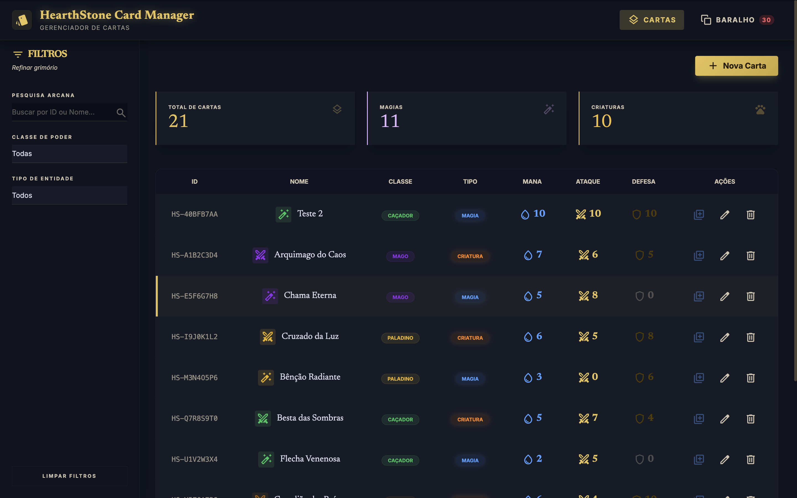
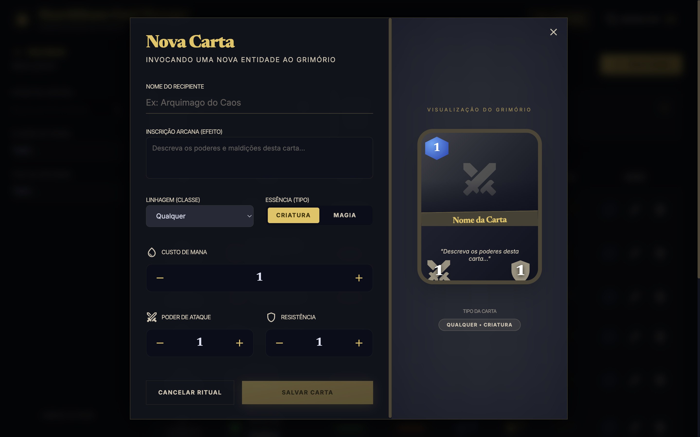
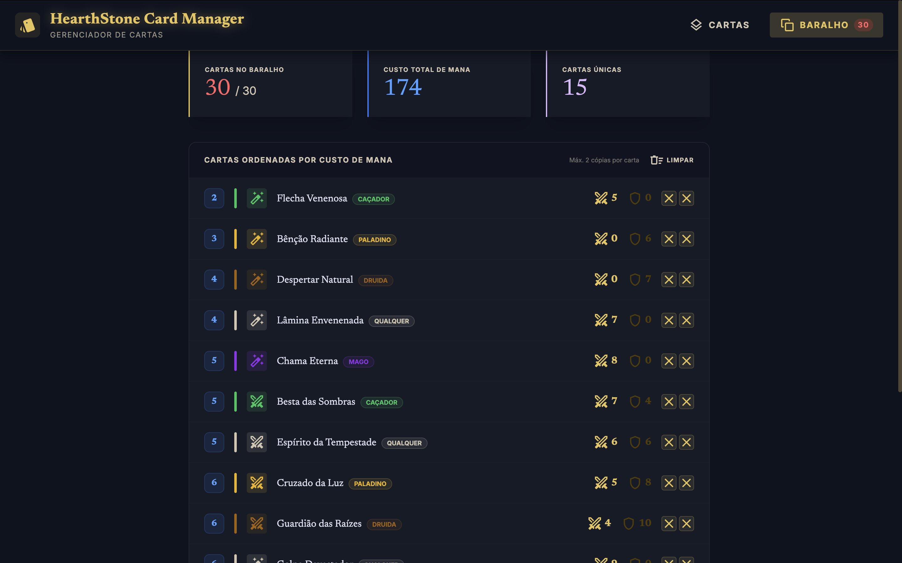
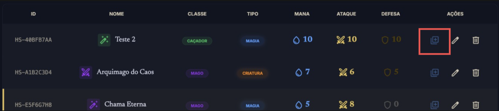
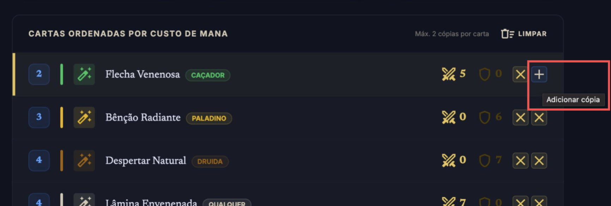

# HearthStone Card Manager

Gerenciador de cartas do HearthStone com suporte a criação, edição, exclusão e filtragem. Construído com React Router v7, TypeScript e TailwindCSS v4.

## Telas e Formulários

### CRUD de Cartas



### Cadastro/Edição de Novas Cartas



### Controle de Cartas no Baralho



## Utilização:

O projeto é composto por duas abas: **Cartas** e **Baralhos**.

Na aba **Cartas**, é possível cadastrar, editar e excluir cartas do banco de dados mantido no localStorage. Também é possível adicioná-las ao baralho diretamente pela tabela, clicando no botão **Adicionar ao Baralho** presente na coluna de ações:



Na aba **Baralhos**, é possível gerenciar as cartas do baralho atual — visualizá-las e gerar duplicatas clicando em:



## Requisitos Funcionais do projeto:

| ID   | Requisito Funcional                               | Detalhes                                                                 |
| ---- | ------------------------------------------------- | ------------------------------------------------------------------------ |
| RF01 | Cadastro de cartas                                | Permitir incluir novas cartas com todos os campos do modelo              |
| RF02 | Consulta de cartas                                | Filtrar cartas por id, nome, classe e tipo                               |
| RF03 | Edição de cartas                                  | Permitir alterar os dados de uma carta existente                         |
| RF04 | Exclusão de cartas                                | Permitir remover uma carta do banco de dados                             |
| RF05 | Persistência em localStorage                      | Todos os dados devem ser armazenados no localStorage do navegador        |
| RF06 | Montagem de baralho                               | Permitir ao jogador montar um baralho com até 30 cartas                  |
| RF07 | Restrição de classe no baralho                    | O baralho só pode conter cartas da classe do jogador ou do tipo Qualquer |
| RF08 | Limite de duplicatas no baralho                   | Permitir no máximo 2 cópias da mesma carta no baralho                    |
| RF09 | Modelo de carta com atributos obrigatórios        | Toda carta deve ter: id, nome, descrição, ataque, defesa, tipo e classe  |
| RF10 | Suporte aos tipos de carta                        | Sistema deve suportar os tipos Magia e Criatura                          |
| RF11 | Suporte às classes                                | Sistema deve suportar: Mago, Paladino, Caçador, Druida e Qualquer        |
| RF12 | Atributos numéricos dentro do intervalo permitido | Ataque e Defesa devem aceitar valores inteiros de 0 a 10                 |

## Pré-requisitos

- Node.js >= 22
- npm >= 10
- Docker (opcional, para rodar via container)

## Rodando localmente

### 1. Instalar dependências

```bash
nvm use 22  # se estiver usando nvm
npm install
```

### 2. Iniciar o servidor de desenvolvimento

```bash
npm run dev
```

A aplicação estará disponível em `http://localhost:5173`.

### 3. Build de produção

```bash
npm run build
npm run start
```

A aplicação estará disponível em `http://localhost:3000`.

---

## Rodando via Docker

### Abrir Docker

```bash
open -a Docker
```

### Build da imagem

```bash
docker build -t my-deck-hearthstone .
```

### Iniciar o container

```bash
docker run -p 3000:3000 my-deck-hearthstone
```

A aplicação estará disponível em `http://localhost:3000`.

---

## Scripts disponíveis

| Script              | Descrição                                    |
| ------------------- | -------------------------------------------- |
| `npm run dev`       | Inicia o servidor de desenvolvimento com HMR |
| `npm run build`     | Gera o build de produção                     |
| `npm run start`     | Inicia o servidor de produção                |
| `npm run typecheck` | Valida os tipos TypeScript                   |
